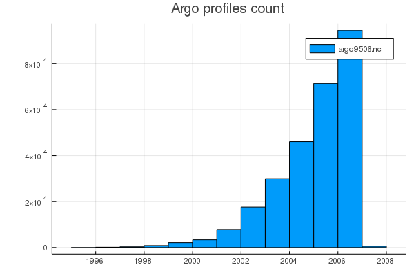

# ArgoData

Argo data processing and analysis. The initial `MITprof_read` example relies on a [standard depth Argo data set](https://doi.org/10.7910/DVN/EE3C40). For more information, please refer to [Forget, et al 2015](http://dx.doi.org/10.5194/gmd-8-3071-2015).

_This package is in early developement stage when breaking changes can be expected._

Argo profiles count           |  Argo profiles map 
:------------------------------:|:---------------------------------:
  |  
